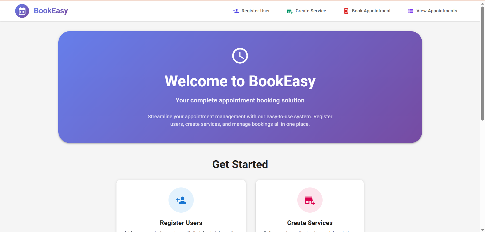
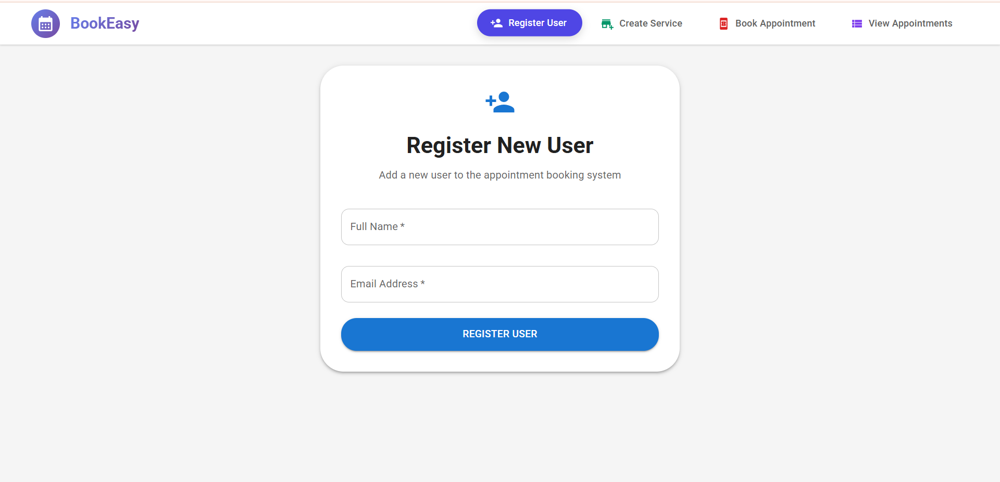
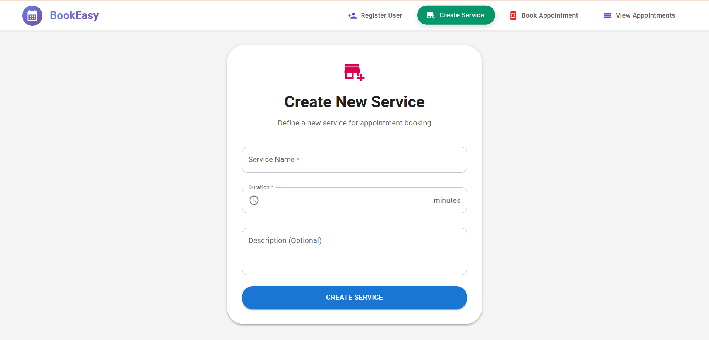
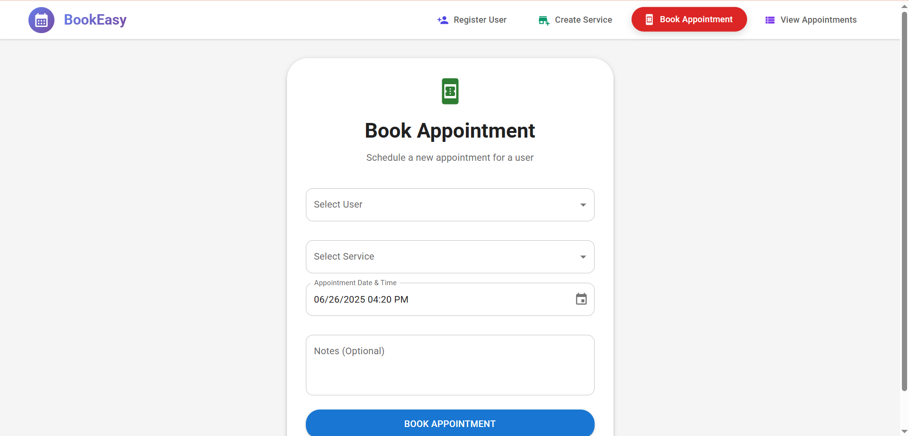
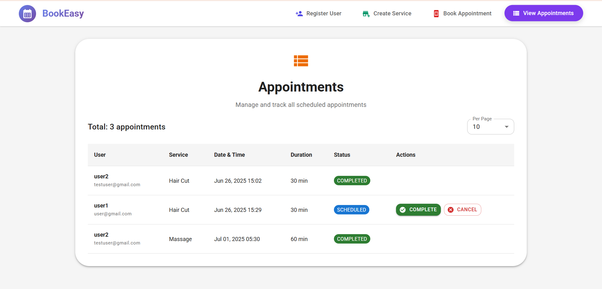

# 📅 Appointment Booking System

A complete appointment booking system for businesses like salons, clinics, and service providers.

## What is this?

This system helps businesses manage appointments easily. Customers can book appointments online, and business owners can manage everything from one dashboard.

**Perfect for:**

- Hair salons & beauty parlors
- Medical clinics & hospitals
- Consulting services
- Fitness centers & gyms
- Any business that takes appointments

## 🚀 Live Demo

- **Frontend**: https://appointment-booking-system-ynsc.onrender.com
- **Backend API**: https://appointment-booking-system-backend-aa4o.onrender.com
  
## Features

- ✅ User registration and management
- ✅ Service creation (Hair Cut, Massage, Consultation, etc.)
- ✅ Appointment booking with date/time selection
- ✅ View all appointments in one place
- ✅ Update appointment status (Complete/Cancel)
- ✅ Responsive design - works on mobile and desktop
- ✅ Real-time validation and error handling
- ✅ Pagination for large datasets

## Screenshots

### Homepage



### User Registration



### Service Creation



### Appointment Booking



### Appointment Management




## Technology Stack

**Frontend:**

- React.js
- Material-UI (Beautiful components)
- JavaScript


**Backend:**

- Node.js
- Express.js
- MongoDB (Database)
- Mongoose (Database modeling)


## Quick Setup

### Prerequisites

- Node.js (v14 or higher)
- MongoDB (local installation or MongoDB Atlas)
- Git


### Installation

1. **Clone the repository**

```shellscript
git clone https://github.com/lokeshvijay7/appointment-booking-system.git
cd appointment-booking-system
```


2. **Backend Setup**

```shellscript
cd backend
npm install
```

Create `.env` file:

```plaintext
MONGODB_URI=mongodb://localhost:27017/appointment-booking
PORT=5000
```


3. **Frontend Setup**

```shellscript
cd frontend
npm install
```


4. **Start the Application**

**Terminal 1 (Backend):**

```shellscript
cd backend
npm run dev
```

**Terminal 2 (Frontend):**

```shellscript
cd frontend
npm start
```

## How to Use

### 1. Register Users

- Navigate to "Register User"
- Enter customer name and email
- Click "Register User"


### 2. Create Services

- Go to "Create Service"
- Add service details:

- Name (e.g., "Hair Cut")
- Duration in minutes (e.g., 30)
- Description


- Click "Create Service"


### 3. Book Appointments

- Navigate to "Book Appointment"
- Select user from dropdown
- Select service from dropdown
- Choose date and time
- Add optional notes
- Click "Book Appointment"


### 4. Manage Appointments

- Go to "View Appointments"
- See all bookings with details
- Update status (Complete/Cancel)
- Use pagination to navigate through appointments


## API Documentation

### Base URL

```plaintext
Local: http://localhost:5000
```

### Endpoints

| Method | Endpoint | Description
|-----|-----|-----
| GET | `/` | Health check
| POST | `/api/users` | Create new user
| GET | `/api/users` | Get all users
| POST | `/api/services` | Create new service
| GET | `/api/services` | Get all services
| POST | `/api/appointments` | Book appointment
| GET | `/api/appointments` | Get appointments (paginated)
| PUT | `/api/appointments/:id/status` | Update appointment status


### Example API Calls

**Create User:**

```json
POST /api/users
{
  "name": "John Doe",
  "email": "john@example.com"
}
```

**Create Service:**

```json
POST /api/services
{
  "name": "Hair Cut",
  "duration": 30,
  "description": "Professional hair cutting"
}
```

**Book Appointment:**

```json
POST /api/appointments
{
  "userId": "user_id_here",
  "serviceId": "service_id_here",
  "scheduledAt": "2024-12-30T14:00:00.000Z",
  "notes": "First appointment"
}
```

## 🧪 Testing with Postman

You can test all APIs using Postman. Follow the steps below to import the collections and execute the requests in order.

### 📁 Folder Structure

```plaintext
postman/
├── User.postman_collection.json
├── Service.postman_collection.json
└── Appointment.postman_collection.json
```

### 📄 Collections

- [**User.postman_collection.json**](postman/User.postman_collection.json) – Contains all user-related requests (e.g., register, login).
- [**Service.postman_collection.json**](postman/Service.postman_collection.json) – Includes all service creation and retrieval endpoints.
- [**Appointment.postman_collection.json**](postman/Appointment.postman_collection.json) – Covers appointment booking and viewing APIs.

### ✅ How to Use

1. Open Postman.
2. Import all three `.json` files from the `postman` folder.
3. (Optional) Set up any environment variables if required.
4. Run the API requests in the following order:
   - `Create User`
   - `Create Service`
   - `Book Appointment`
   - `Get Appointments`


## Project Structure

```plaintext
appointment-booking-system/
├── backend/
│   ├── config/
│   │   └── database.js          # MongoDB connection
│   ├── controllers/
│   │   ├── userController.js    # User logic
│   │   ├── serviceController.js # Service logic
│   │   └── appointmentController.js # Appointment logic
│   ├── models/
│   │   ├── User.js              # User model
│   │   ├── Service.js           # Service model
│   │   └── Appointment.js       # Appointment model
│   ├── routes/
│   │   ├── users.js             # User routes
│   │   ├── services.js          # Service routes
│   │   └── appointments.js      # Appointment routes
│   ├── middlewares/
│   │   └── validation.js        # Input validation
│   ├── server.js                # Main server file
│   ├── package.json
│   └── .env.example
├── frontend/
│   ├── public/
│   │   └── index.html
│   ├── src/
│   │   ├── components/
│   │   │   └── Navbar.js        # Navigation
│   │   ├── pages/
│   │   │   ├── Home.js          # Homepage
│   │   │   ├── RegisterUser.js  # User registration
│   │   │   ├── CreateService.js # Service creation
│   │   │   ├── BookAppointment.js # Booking page
│   │   │   └── ViewAppointments.js # Appointment management
│   │   ├── App.js               # Main app component
│   │   └── index.js             # Entry point
│   └── package.json
├── postman/
│   ├── User.postman_collection.json
│   └── Service.postman_collection.json
│   └── Appointment.postman_collection.json
├── README.md
├── .gitignore
├── LICENSE
└── CONTRIBUTING.md
```


## Database Schema

### User Model

```javascript
{
  name: String (required),
  email: String (required, unique),
  createdAt: Date,
  updatedAt: Date
}
```

### Service Model

```javascript
{
  name: String (required),
  duration: Number (required, min: 15),
  description: String,
  createdAt: Date,
  updatedAt: Date
}
```

### Appointment Model

```javascript
{
  userId: ObjectId (ref: User),
  serviceId: ObjectId (ref: Service),
  scheduledAt: Date (required, future date),
  status: String (scheduled/completed/cancelled),
  notes: String,
  createdAt: Date,
  updatedAt: Date
}
```

## Validation Rules

- **User email:** Must be valid email format and unique
- **Service duration:** Minimum 15 minutes
- **Appointment date:** Must be in the future
- **All required fields:** Cannot be empty


## Error Handling

The system includes comprehensive error handling:

- Input validation errors
- Database connection errors
- Duplicate data errors
- Not found errors
- Server errors


All errors return proper HTTP status codes and user-friendly messages.

## Troubleshooting

**Backend won't start?**

- Check if MongoDB is running
- Verify port 5000 is available
- Check .env file exists with correct database URL


**Frontend won't start?**

- Ensure you're in the frontend directory
- Try deleting node_modules and run `npm install`
- Check if port 3000 is available


**Database connection failed?**

- Start MongoDB: `mongod`
- Check connection string in .env
- For MongoDB Atlas, verify network access


**API requests failing?**

- Ensure backend is running on port 5000
- Check API endpoints in browser
- Use Postman collection to test APIs


## Future Enhancements

- 🔐 User authentication and login
- 📧 Email notifications for appointments
- 💳 Payment integration
- 📱 Mobile app version
- 📊 Analytics dashboard
- 🗓️ Calendar integration
- 🔔 SMS reminders
- 👥 Multi-user support


## 👨‍💻 Author

**Lokesh K V**
- GitHub: https://github.com/lokeshvijay7
- Email: loki7cr@gmail.com

  
## Acknowledgments

- React team for the amazing framework
- Material-UI for beautiful components
- MongoDB for flexible database
- Express.js for robust backend framework
- Node.js community for excellent ecosystem


---

**⭐ If this project helped you, please give it a star!**

